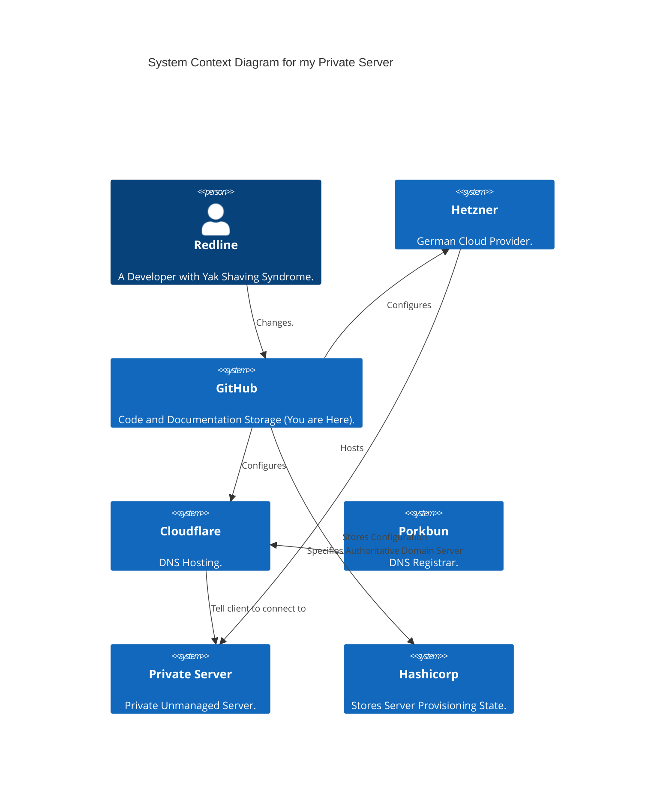
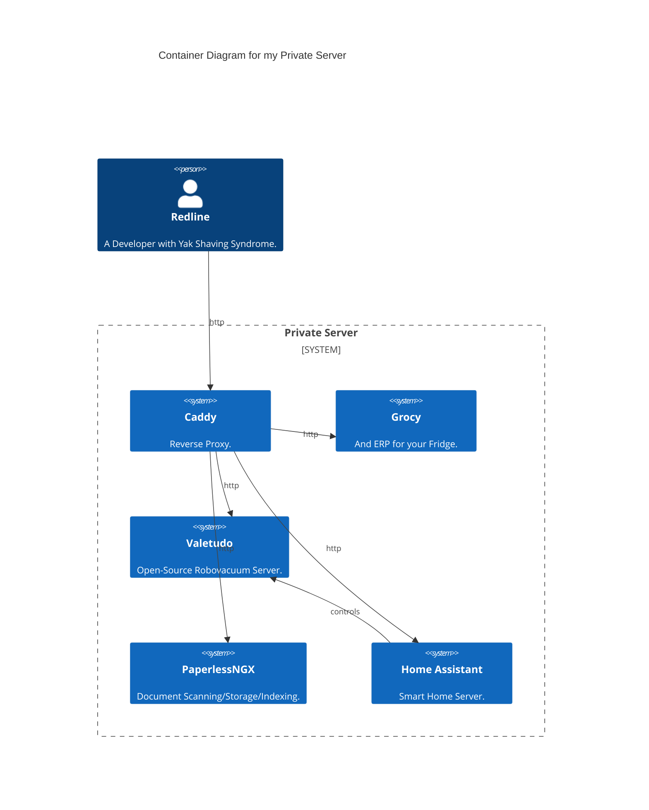

My entire private server as code including testing

```mermaid
C4Context
title System Context Diagram for my Private Server

Person(developer, "Redline", "A Developer with Yak Shaving Syndrome.")
System(hetzner, "Hetzner", "German Cloud Provider.")
System(github, "GitHub", "Code and Documentation Storage (You are Here).")
System(cloudflare, "Cloudflare", "DNS Hosting.")
System(porkbun, "Porkbun", "DNS Registrar.")
System(server, "Private Server", "Private Unmanaged Server.")
System(hashicorp, "Hashicorp", "Stores Server Provisioning State.")

Rel(github, cloudflare, "Configures")
Rel(github, hetzner, "Configures")
Rel(github, hashicorp, "Stores Configuration")

Rel(hetzner, server, "Hosts")
Rel(porkbun, cloudflare, "Specifies Authoritative Domain Server")
Rel(cloudflare, server, "Tell client to connect to")

Rel(developer, github, "Changes.")
```

```mermaid
C4Container
title Container Diagram for my Private Server

Person(developer, "Redline", "A Developer with Yak Shaving Syndrome.")


System_Boundary(server, "Private Server") {
    System(caddy, "Caddy", "Reverse Proxy.")
    System(grocy, "Grocy", "And ERP for your Fridge.")
    System(valetudo, "Valetudo", "Open-Source Robovacuum Server.")
    System(paperlessngx, "PaperlessNGX", "Document Scanning/Storage/Indexing.")
    System(homeassistant, "Home Assistant", "Smart Home Server.")

    Rel(caddy, grocy, "http")
    Rel(caddy, valetudo, "http")
    Rel(caddy, paperlessngx, "http")
    Rel(caddy, homeassistant, "http")

    Rel(homeassistant, valetudo, "controls")
}

Rel(developer, caddy, "http")
```