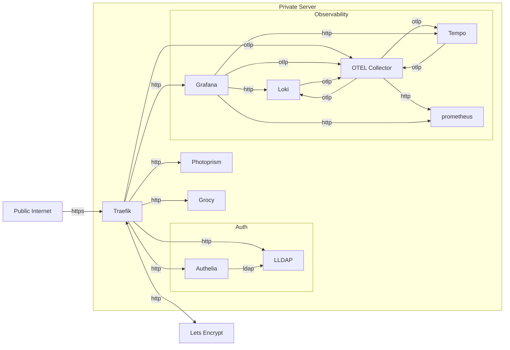
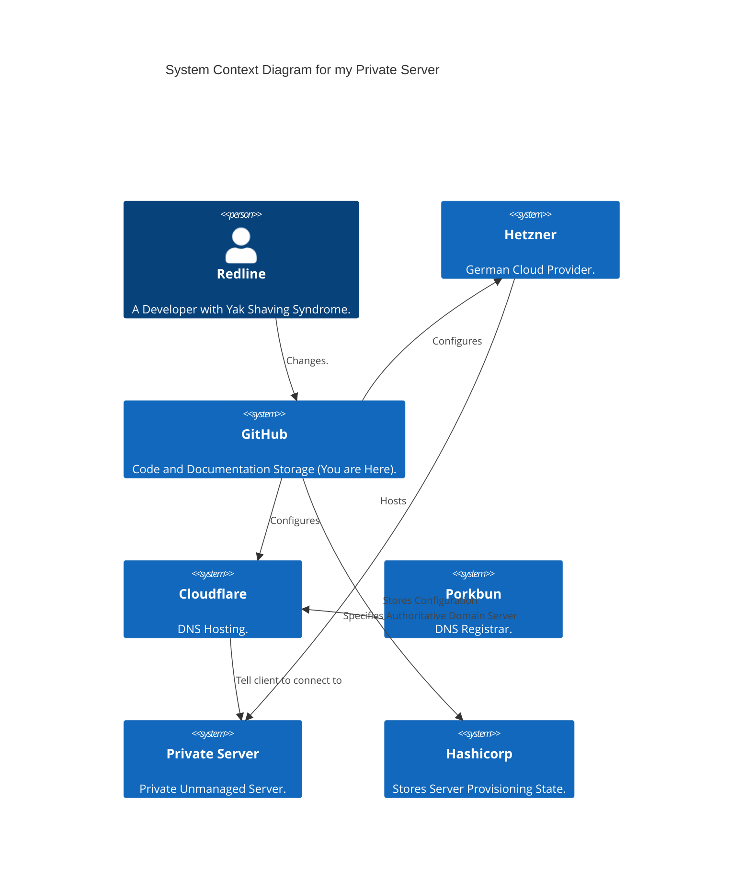

My entire private server as code including testing

```mermaid
graph LR
web[Public Internet]
web-- https --> traefik
letsencrypt[Lets Encrypt]
traefik-- http <--> letsencrypt

subgraph Private Server
traefik[Traefik]
photoprism[Photoprism]
grocy[Grocy]

traefik-- http --> authelia
traefik-- http --> grocy
traefik-- http --> photoprism
traefik-- http --> grafana
traefik-- http --> lldap
traefik-- otlp --> otel

subgraph Auth
authelia[Authelia]
lldap[LLDAP]

authelia-- ldap --> lldap
end

subgraph Observability
grafana[Grafana]
loki[Loki]
tempo[Tempo]
otel[OTEL Collector]

otel-- otlp --> loki
otel-- http --> prometheus
otel-- otlp --> tempo
grafana-- http --> loki
grafana-- http --> prometheus
grafana-- http --> tempo
grafana-- otlp --> otel
tempo-- otlp --> otel
loki-- otlp --> otel
end
end
```

```mermaid
C4Context
title System Context Diagram for my Private Server

Person(developer, "Redline", "A Developer with Yak Shaving Syndrome.")
System(hetzner, "Hetzner", "German Cloud Provider.")
System(github, "GitHub", "Code and Documentation Storage (You are Here).")
System(cloudflare, "Cloudflare", "DNS Hosting.")
System(porkbun, "Porkbun", "DNS Registrar.")
System(server, "Private Server", "Private Unmanaged Server.")
System(hashicorp, "Hashicorp", "Stores Server Provisioning State.")

Rel(github, cloudflare, "Configures")
Rel(github, hetzner, "Configures")
Rel(github, hashicorp, "Stores Configuration")

Rel(hetzner, server, "Hosts")
Rel(porkbun, cloudflare, "Specifies Authoritative Domain Server")
Rel(cloudflare, server, "Tell client to connect to")

Rel(developer, github, "Changes.")
```
This is a test commit to test ci
